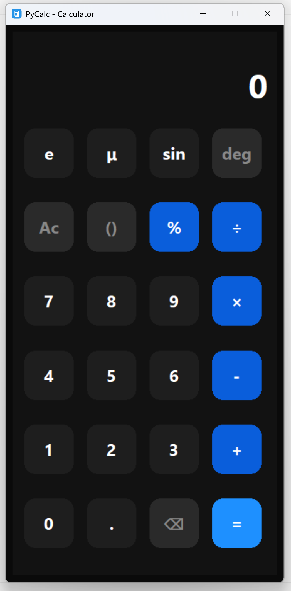

# PyCalc

PyCalc is a simple yet powerful Python calculator application featuring a sleek graphical user interface built with Tkinter. It supports basic arithmetic operations, scientific functions, and intuitive input handling, making it a handy tool for everyday calculations.

## Features

- User-friendly GUI with rounded buttons and modern design
- Basic arithmetic operations: addition, subtraction, multiplication, division, and modulus
- Support for parentheses to control operation precedence
- Scientific functions including sine (`sin`), mathematical constant Euler's number (`e`), and micro symbol (`μ`)
- Clear (`Ac`), backspace (`⌫`), and equals (`=`) buttons for easy input correction and evaluation
- Keyboard-friendly input and responsive button layout

## 📸 Screenshot



## Installation

Clone the repository and install the package using pip:

```bash
git clone https://github.com/c-onfused69/pycalc.git
cd pycalc
pip install .
```

Alternatively, you can install directly from the source directory:

```bash
pip install .
```

## Usage

After installation, launch the calculator GUI from the command line:

```bash
pycalc
```

This will open the PyCalc graphical interface where you can perform calculations using the buttons.

## Development

The source code is organized under the `src/pycalc` directory:

- `calculator.py`: Core calculation logic and expression evaluation
- `gui.py`: Tkinter-based graphical user interface implementation
- `__main__.py`: Entry point to launch the GUI application

To run the application directly without installation, use:

```bash
python -m pycalc
```

## Testing

Tests are located in the `tests` directory. To run tests, use your preferred test runner, for example:

```bash
pytest
```

## License

This project is licensed under the MIT License. See the [LICENSE](LICENSE) file for details.

## Contributing

Contributions are welcome! Please open issues or submit pull requests for improvements or bug fixes.

---

Created with ❤️ by the c-onfused69.
